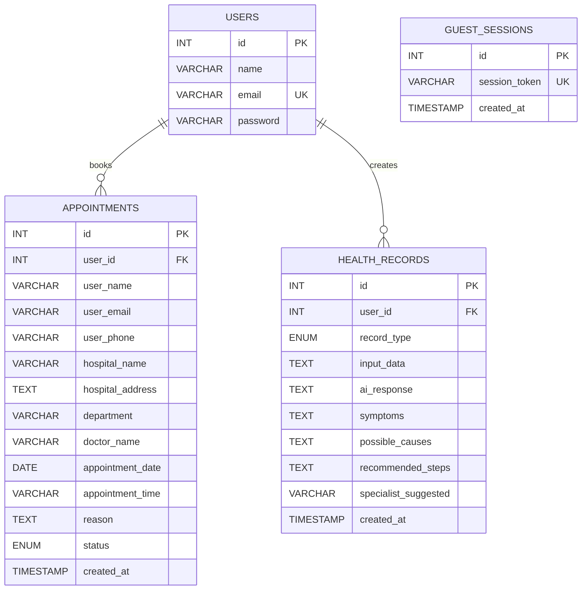

# Care India

Care India is a React + TypeScript frontend with an Express + MySQL backend for authentication, guest access, appointment booking, and health record storage.

## Stack

- Frontend: React, TypeScript, Vite
- Backend: Node.js, Express
- Database: MySQL with `mysql2`
- Auth: JWT + bcrypt

## Setup

### Frontend

Copy `.env.example` to `.env` and set:

- `VITE_API_BASE_URL`
- `VITE_GEMINI_API_KEY`

Install and run:

```bash
npm install
npm run dev
```

### Backend

Copy `backend/.env.example` to `backend/.env` and set:

- `JWT_SECRET`
- `DB_HOST`
- `DB_PORT`
- `DB_USER`
- `DB_PASSWORD`
- `DB_NAME`
- `CLIENT_URL`

Install and run:

```bash
cd backend
npm install
npm run dev
```

## Auth API

- `POST /api/register`
- `POST /api/login`
- `GET /api/guest`
- `GET /api/auth/me`

## Deployment

### Vercel Frontend

Set these environment variables in Vercel:

- `VITE_API_BASE_URL=https://your-backend-domain/api`
- `VITE_GEMINI_API_KEY=your_gemini_api_key`

Do not leave `VITE_API_BASE_URL` pointed at `localhost` in production.

### Backend Host

Deploy the `backend` folder to a Node.js host such as Render or Railway and set:

- `PORT=5000`
- `CLIENT_URL=https://your-vercel-app.vercel.app`
- `JWT_SECRET`
- `DB_HOST`
- `DB_PORT`
- `DB_USER`
- `DB_PASSWORD`
- `DB_NAME`

`CLIENT_URL` also supports multiple comma-separated origins for local + production, for example:

```env
CLIENT_URL=http://localhost:5173,https://your-vercel-app.vercel.app
```

## Database

The backend auto-creates:

- `users`
- `appointments`
- `health_records`
- `guest_sessions`

`users` table:

```sql
CREATE TABLE users (
  id INT AUTO_INCREMENT PRIMARY KEY,
  name VARCHAR(100),
  email VARCHAR(100) UNIQUE,
  password VARCHAR(255)
);
```

## ER Diagram



## Verification

Frontend production build:

```bash
npm run build
```

Backend syntax check:

```bash
cd backend
npm run check
```
